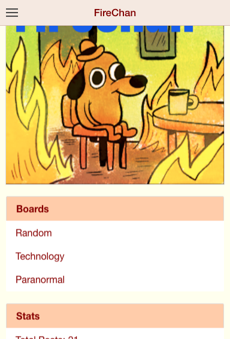
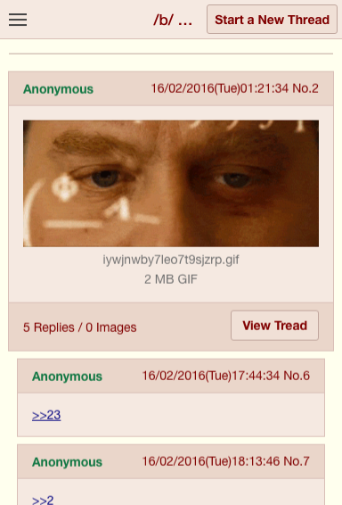

# FireChan
=====================
This example application showing how to use [Firebase](https://www.firebase.com/) and [Cloudinary](https://www.cloudinary.com) with the [Ionic Framework](http://ionicframework.com/)
##Features
FireChan is a basic 4chan clone  with following features:
- Users can create a new thread 
- Users can create a reply
- Users can write green text with the character '>'
- User can post to quote the post id touching
- Users can tap an quote and automatically go to post cited
- Users can touch the post creation time by 0.5s and display when it was created

###Screenshots

## Getting Started

### Configure Firebase

0. Go to your [Firebase Dashboard](https://www.firebase.com/account/) and create a new Firebase app.
0. Edit [`constants.js`](www/vendor/core/constants.js) and change the value of `FBURL` to point to your Firebase.

### Configure Cloudinary

0. Go to your [Cloudinary Settings](https://cloudinary.com/console/settings/upload) and add uploading preset unsigned.
0. Edit [`constants.js`](www/vendor/core/constants.js) and change the value of `CLOUDINARY_URI` with your api upload .
0. Edit [`constants.js`](www/vendor/core/constants.js) and change `CLOUDINARY_UPLOAD_PRESET` with your upload preset.

**Install Ionic**

If you haven't installed Ionic already, follow the instructions [here](http://ionicframework.com/getting-started/).

**Add your platforms**

    $ ionic platform add android
    
**Add Cordova plugins**

    $ cordova plugin add cordova-plugin-file
    $ cordova plugin add cordova-plugin-file-transfer
    $ cordova plugin add cordova-plugin-camera
    $ cordova plugin add https://github.com/EddyVerbruggen/Toast-PhoneGap-Plugin.git
    $ cordova plugin add https://github.com/apache/cordova-plugin-whitelist.git

**Run the app with Ionic**

    $ ionic build android
    $ ionic emulate android 

## Data Structure Example

	$ {
	$	"countGlobal":{
	$		"count":2
	$	},
	$	"posts" :{
	$		"b":{
	$			"-KAhQ63u6mRWHAEEo4fn":{
	$				"count": 1,
	$				"img": "h9prm8koyto9xz4vw48p",
	$				"imgBytes": "97523",
	$				"imgFormat":"jpg",
	$				"num":1,
	$				"time":1455682253418
	$			}
	$		}
	$	},
	$	"comment":{
	$		"b":{
	$			"-KAhQ63u6mRWHAEEo4fn":{
	$				"-KAhRhE5yuUkCdWBf2qe":{
	$					"count": 1,
	$					"num":1,
	$					"time":1455682253418,
	$					text: ">>1\nDude"
 	$
	$				}
	$			}
	$		}
	$	}
	$
	$  }

## Help
Contact via email at eds.perez@outlook.com 
